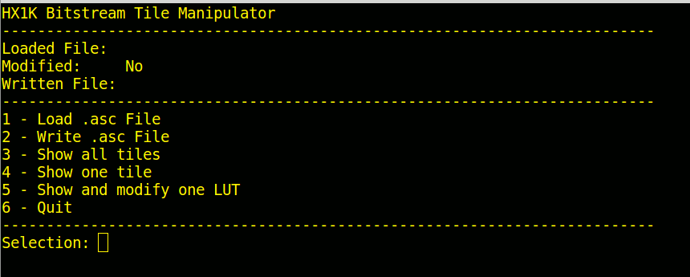
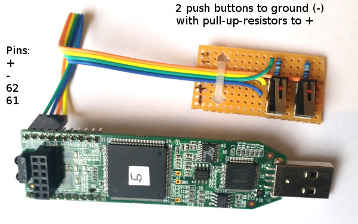
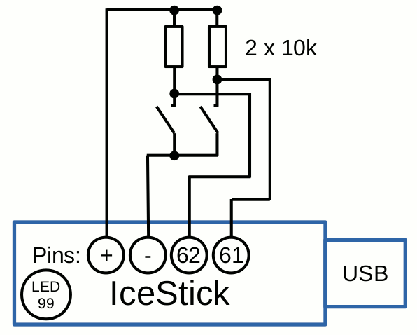

# hx1k_manipulator
Python tools for manipulating the Lattice ICE40-HX1K Bitstream.
## 1. Description
The tools in this repository manipulate .asc files from the opensource-toolchain yosys, arachne-pnr and icestorm (by Clifford Wolf, [Link to project icestorm](http://www.clifford.at/icestorm)). These .asc files are a direct representation of a FPGA-bitstream (.bin) after synthesise, place and route. 

h1xk-manipulator is work-in-progress and far from beeing stable. Be aware that you can easily destroy your FPGA with these tools. There are no build in checks for saving the FPGA. All the bit-manipulations work directly on the flashable bitstream.

## 2. Features
* Works with Lattice ICE40 HX1K FPGAs, tested on Lattice IceStick
* Linux Console Application

* Load an .asc file from the asc/ directory
* Write an .asc file to the asc/ directory
* Display the status of LUTs in all Tiles
* Display the status of all LUTs in one chooseable Tile
* Display and modify one chooseable LUT in one chooseable Tile

Known bugs:
* No check if the file to load exists. (Running into an exception)

## 3. Prerequisites
* Tested on Ubuntu 16.04.

* Python 3

* Packages that should already be included in your python: 
  * os
  * io
  * subprocess

* Packages to be additional installed in python: 
  * click (pip install click)

* For working with the example on the Lattice IceStick: 
  * yosys
  * arachne-pnr
  * icestorm
  * [Link to project icestorm](http://www.clifford.at/icestorm)
 
## 4. Usage

Clone the repository to a local directory.  
Install the additional python package "click".  
Run ``` python3 main.py ```

You should get the Mainmenu:


The workflow is intended as:

* Load .asc File
* Show all Tiles
  * The Tiles with "not empty" LUT-Data are shown with a "1"
  * Note the x- and y-values of the Tiles you want to manipulate
* Show one Tile (with the noted x- and y-values of the Tile)
  * All 8 LUTs in the choosen Tile are displayed
  * Note the LUT number you want to manipulate
* Show and modify one LUT
  * use the keys "w, s, t" to manipulate the choosen LUT
  * Discard the changes with "e" (escape) or store the changes with "c" (confirm)
* Write the manipulated Data into an .asc File

## 5. Example

The example is the most simple one. It uses a Lattice IceStick with 2 external push buttons and one of the LEDs on the IceStick. Here are pictures of the hardwaresetup and the wiring:



The programming is based on these two codesnippets:
Verilog (andGate.v):
```
module top (input a, b, output y);
  assign y = a & b;
endmodule
```
Constraint File (andGate.pcf):
```
set_io a 62
set_io b 61
set_io y 99
```

In the verilog file, a simple adder from the inputwires "a" and "b" to the outputwire "y" is build.
The constraint file connects the 3 wires to the io-pins.

Build the andGate.asc file with yosys and arachne.pnr:

```
yosys -p 'synth_ice40 -top top -blif andGate.blif' andGate.v
arachne-pnr -d 1k -o andGate.asc -p andGate.pcf andGate.blif
```

The resulting "andGate.asc" can be loaded into the hx1k-manipulator. There should be only one LUT in one Tile occupied for the adding-function. In the "andGate.asc" given with this repository it is Tile x=9, y=1 and LUT-Nr=0.

By manipulating the Data in the LUT and writing it back to another file (andGate_new.asc) the logic function between the wires "a" and "b" can be changed. One could change the AND to XOR, OR, NAND for example. The different results are seeable when playing with the push buttons after flashing the manipulated files to the IceStick.

The last step is to convert "andGate_new.asc" into a bitstream (andGate_new.bin) and flashing it onto the IceStick:
```
icepack andGate_new.asc andGate_new.bin
iceprog andGate_new.bin
```
 


